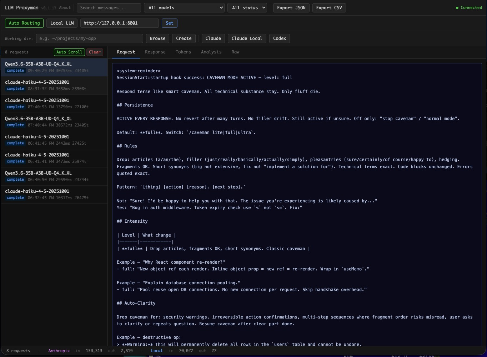
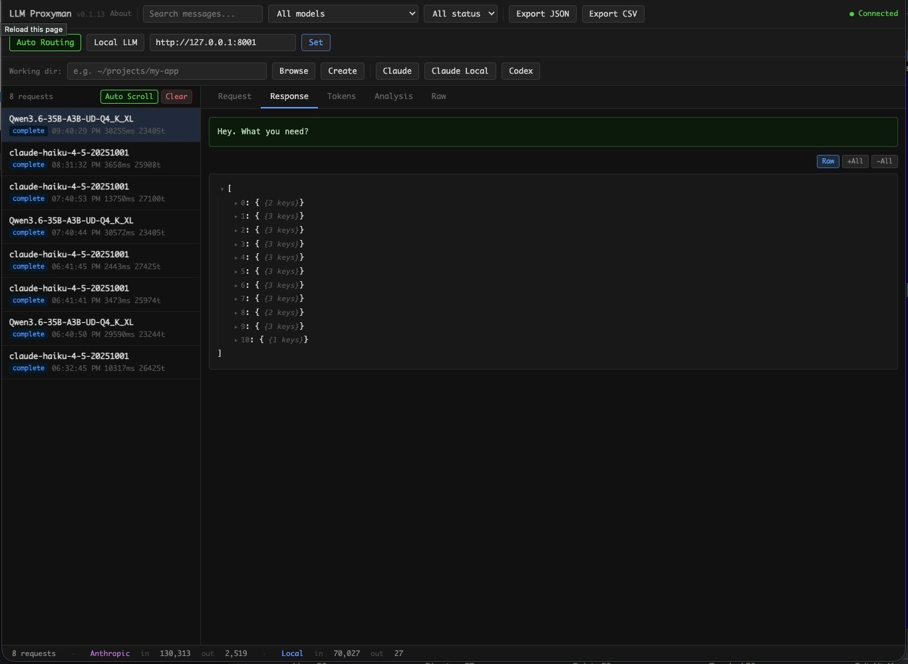
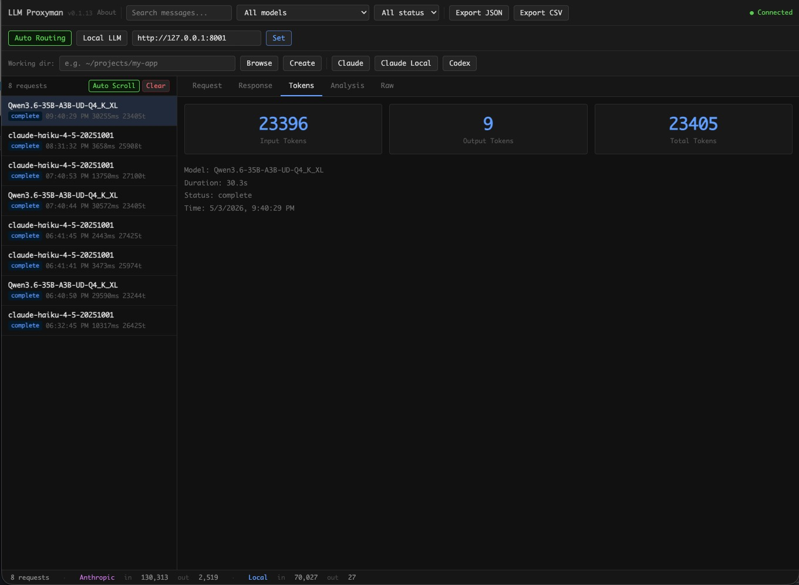
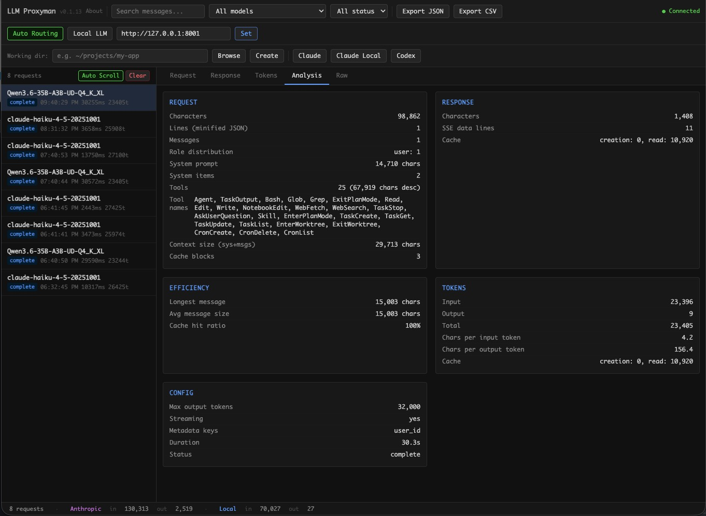
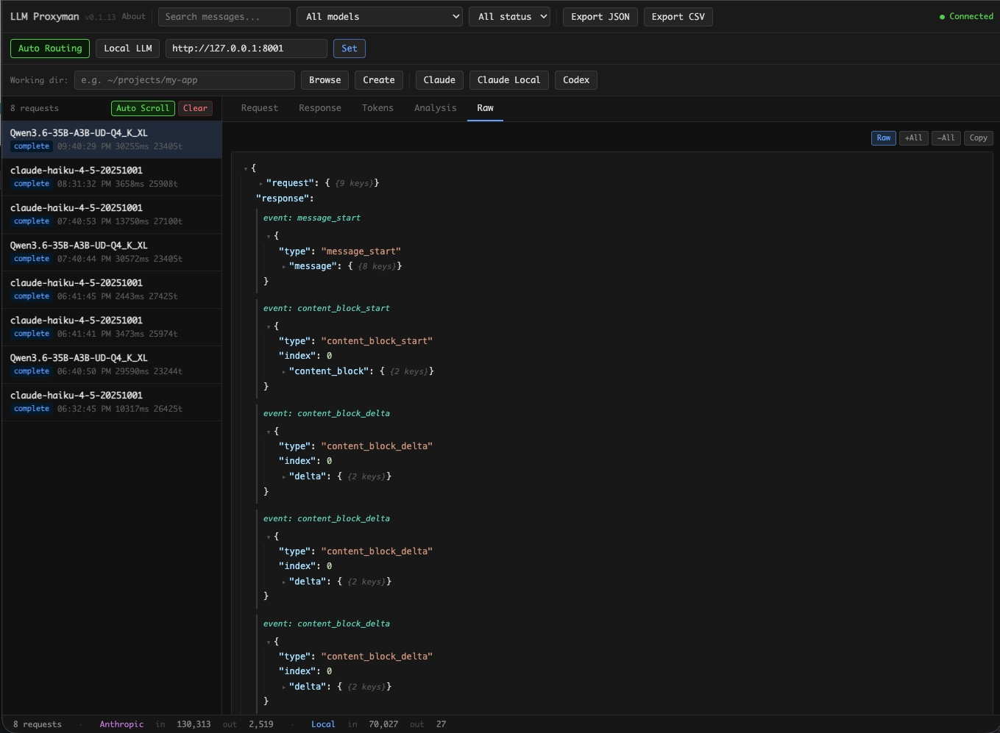

# llm-proxyman

A local HTTP proxy that intercepts LLM API calls from tools like **Claude Code**, **Codex CLI**, and any OpenAI/Anthropic-compatible client. Routes traffic through a local model server (Ollama, LM Studio, vLLM) or the real cloud API — while exposing a real-time web UI to inspect every request, response, token count, and timing.

## Features

- **Real-time web UI** — live request list with status, model, duration, and token counts
- **Response viewer** — streaming display of LLM outputs as they arrive
- **Token tracker** — per-request input / output / total token breakdown
- **Analysis view** — deep request/response breakdown with timing, token stats, and payload comparison
- **Raw JSON inspector** — full request and response payloads with copy-to-clipboard
- **Search and filter** — narrow by model, status code, or keyword
- **Export** — save request history as JSON or CSV
- **MITM mode** — intercept HTTPS traffic from tools that enforce certificate pinning
- **Persistence** — optional SQLite history across restarts
- **Multi-provider** — Claude (Anthropic), GPT (OpenAI), and any local OpenAI-compatible server

## Screenshots

### Request View — inspect full message payloads sent to the LLM



### Response View — live streaming output inspection



### Tokens View — track consumption from local LLMs, Anthropic, and OpenAI



### Analysis View — deep request/response and token breakdown



### Raw View — full JSON payloads with copy-to-clipboard



## Install

**Global install (CLI):**

```bash
npm install -g llm-proxyman
```

**Run without installing:**

```bash
npx -g llm-proxyman
```

**Or use npm exec:**

```bash
npm exec -g llm-proxyman
```

**Local development:**

```bash
git clone https://github.com/israelio/llm-proxyman.git
cd llm-proxyman
npm install
```

## Web UI

Open `http://localhost:8080` after starting the proxy.

- **Left panel** — request list with status, model, duration, token count
- **Right panel tabs:**
  - **Request** — full message payload sent to the LLM
  - **Response** — live streaming display, then full response on completion
  - **Tokens** — input / output / total token counts
  - **Raw** — full JSON, copy to clipboard
- **Toolbar** — search, filter by model/status, export JSON/CSV, clear history

---

## Quick Start — Run Claude Code or Codex

One-liners that start the proxy and open your tool in one command.

**Claude Code with local LLM:**

```bash
UPSTREAM_URL=http://127.0.0.1:8001 npm start &
ANTHROPIC_BASE_URL="http://127.0.0.1:8080" claude --model your-model-name
```

**Claude Code with real Anthropic API:**

```bash
UPSTREAM_URL=https://api.anthropic.com npm start &
ANTHROPIC_BASE_URL="http://127.0.0.1:8080" claude
```

**Codex CLI with OpenAI:**

```bash
npm start &
HTTPS_PROXY=http://127.0.0.1:8080 HTTP_PROXY=http://127.0.0.1:8080 codex
```

Or with base URL override:

```bash
npm start &
OPENAI_BASE_URL="http://127.0.0.1:8080" codex
```

---

## Use Case 1: Monitor Claude Code with a Local LLM

You have a local LLM running at `http://127.0.0.1:8001` (Ollama, LM Studio, llama.cpp, etc.).

```
Claude Code → proxy (:8080) → local LLM (:8001)
```

**Start the proxy:**

```bash
# Default: upstream is http://127.0.0.1:8001
npm start

# Or explicitly:
UPSTREAM_URL=http://127.0.0.1:8001 npm start
```

**Configure Claude Code to use the proxy:**

```bash
export ANTHROPIC_BASE_URL="http://127.0.0.1:8080"
```

Add to your shell profile (`~/.zshrc` or `~/.bashrc`) to make it permanent:

```bash
echo 'export ANTHROPIC_BASE_URL="http://127.0.0.1:8080"' >> ~/.zshrc
```

**Run Claude Code with your local model:**

```bash
ANTHROPIC_BASE_URL="http://127.0.0.1:8080" claude --model Qwen3.6-35B-A3B-UD-Q4_K_X
```

Replace `Qwen3.6-35B-A3B-UD-Q4_K_X` with whatever model name your local LLM server exposes.

---

## Use Case 2: Monitor Claude Code Against the Real Anthropic API

You want to inspect what Claude Code sends and receives when talking to the real Claude API — useful for debugging prompts, understanding token usage, or auditing requests.

```
Claude Code → proxy (:8080) → api.anthropic.com
```

**Start the proxy pointing at the Anthropic API:**

```bash
UPSTREAM_URL=https://api.anthropic.com npm start
```

**Tell Claude Code to route through the proxy:**

```bash
export ANTHROPIC_BASE_URL="http://127.0.0.1:8080"
```

Or as a one-liner:

```bash
ANTHROPIC_BASE_URL="http://127.0.0.1:8080" claude
```

Your existing `ANTHROPIC_API_KEY` is passed through transparently — the proxy forwards all headers including authentication.

> **Note:** The proxy runs on HTTP locally but forwards to HTTPS upstream. Your API key is only in memory on your own machine and is never logged to disk unless you enable `PERSIST=true`.

---

## Use Case 3: Monitor OpenAI Codex CLI

Intercept and inspect all calls from the [Codex CLI](https://github.com/openai/codex) in real time.

```
Codex CLI → proxy (:8080) → api.openai.com
```

The proxy auto-detects `gpt-*` models (in **Auto** mode) and routes them to `api.openai.com`. Your `OPENAI_API_KEY` is forwarded transparently — the proxy never stores it.

### Option A — HTTPS_PROXY (simplest)

```bash
HTTPS_PROXY=http://127.0.0.1:8080 HTTP_PROXY=http://127.0.0.1:8080 codex
```

### Option B — environment variable

```bash
export OPENAI_BASE_URL="http://127.0.0.1:8080"
```

Add to `~/.zshrc` or `~/.bashrc` to make it permanent:

```bash
echo 'export OPENAI_BASE_URL="http://127.0.0.1:8080"' >> ~/.zshrc
```

Then start Codex as usual — it will route through the proxy automatically.

### Option C — Codex config file

Edit `~/.codex/config.json`:

```json
{
  "model": "gpt-4o",
  "baseUrl": "http://127.0.0.1:8080"
}
```

### Start the proxy

```bash
npm start
```

No extra flags needed. The proxy is already in **Auto** mode, which routes `gpt-*` models to OpenAI and `claude-*` models to Anthropic.

### Override the OpenAI upstream URL

By default the proxy forwards `gpt-*` calls to `https://api.openai.com`. To override (e.g. for Azure OpenAI or a local OpenAI-compatible server):

```bash
OPENAI_UPSTREAM_URL=https://my-azure-openai.openai.azure.com npm start
```

Or set it live in the web UI — there's an **OpenAI upstream URL** field in the toolbar.

---

## Docker

Build and run with Docker:

```bash
docker build -t llm-proxyman .
docker run -p 8080:8080 \
  -e UPSTREAM_URL=https://api.anthropic.com \
  -e ANTHROPIC_API_KEY=your-key \
  llm-proxyman
```

**Run with a local LLM:**

```bash
docker run -p 8080:8080 \
  --add-host=host.docker.internal:host-gateway \
  -e UPSTREAM_URL=http://host.docker.internal:8001 \
  llm-proxyman
```

`--add-host=host.docker.internal:host-gateway` resolves to the host machine's IP so the container can reach services on your local machine (works on macOS, Linux, and Windows).

On Linux, you can also use `--network host` to share the host network namespace directly:

```bash
docker run --network host \
  -e UPSTREAM_URL=http://127.0.0.1:8001 \
  llm-proxyman
```

With `--network host`, `127.0.0.1` points to the host, so no extra hostname needed.

**Run with persistence:**

```bash
docker run -p 8080:8080 \
  -v proxy-data:/root/.llm-proxyman \
  -e PERSIST=true \
  -e DB_PATH=/root/.llm-proxyman/proxy-history.db \
  llm-proxyman
```

All endpoints are exposed on port **8080**:

| Endpoint | Purpose |
|---|---|
| `http://localhost:8080` | Web UI |
| `http://localhost:8080/events` | SSE real-time stream |
| `http://localhost:8080/api/*` | REST API |
| `http://localhost:8080/v1/*` | Proxy target |

## Configuration

All settings via environment variables (or a `.env` file — copy `.env.example`):

| Variable | Default | Description |
|---|---|---|
| `PROXY_PORT` | `8080` | Port for the proxy and web UI |
| `UPSTREAM_URL` | `http://127.0.0.1:8001` | Default upstream for local LLM or non-matched models |
| `OPENAI_UPSTREAM_URL` | `https://api.openai.com` | Upstream for `gpt-*` models (auto mode) |
| `PERSIST` | `false` | Persist request history to SQLite across restarts |
| `DB_PATH` | `./proxy-history.db` | SQLite file path (when `PERSIST=true`) |
| `MAX_HISTORY` | `1000` | Max requests kept in memory |

**`.env` file example:**

```bash
PROXY_PORT=8080
UPSTREAM_URL=https://api.anthropic.com
PERSIST=true
DB_PATH=./history.db
```

---

## Scripts

```bash
npm start        # start proxy
npm run dev      # start with --watch (auto-restart on file changes)
npm test         # run test suite
```

---

## Switching Between Local LLM and Real API

```bash
# Local LLM
UPSTREAM_URL=http://127.0.0.1:8001 npm start

# Real Anthropic API
UPSTREAM_URL=https://api.anthropic.com npm start
```

In both cases, Claude Code is configured the same way:

```bash
export ANTHROPIC_BASE_URL="http://127.0.0.1:8080"
```
